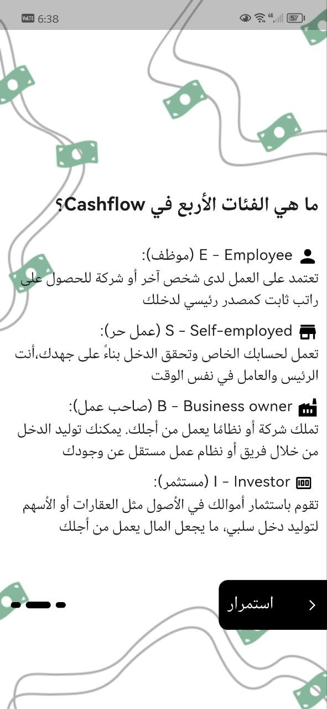
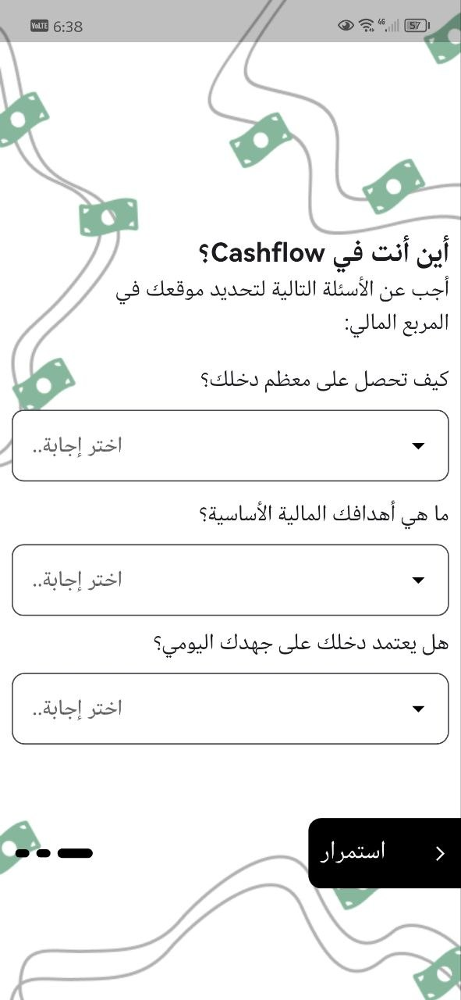
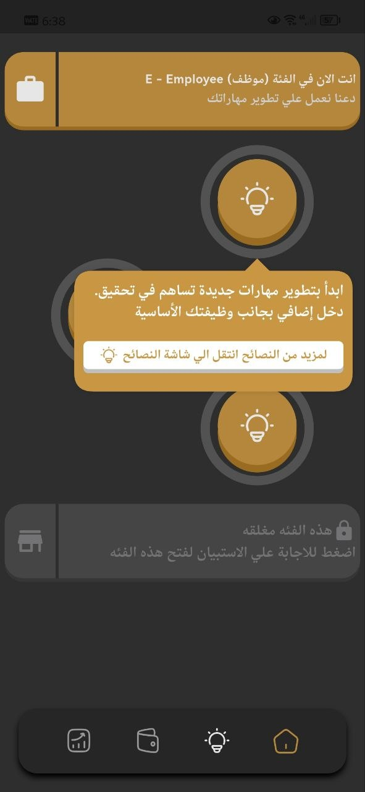
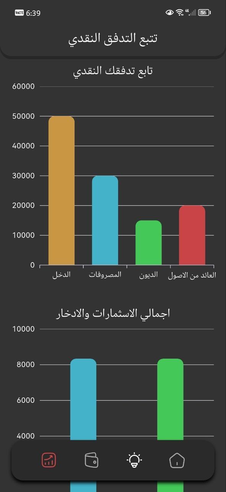

# 💰 Cashflow

A Flutter app that helps you understand your financial position, track your cash flow, and get personalized money advice — based on the popular "Cashflow Quadrant" concept (Employee, Self-employed, Business owner, Investor).

<!-- 
📸 ضيف هنا صورة أو GIF رئيسية للتطبيق (اللي هتظهر فوق كل حاجة)
مثال:

-->

## ✨ Features
- 🧭 Onboarding quiz to identify your Cashflow Quadrant (E / S / B / I)
- 💵 Money management screen — track income, expenses, debts, and return on assets
- 📊 Automatic net income calculation & spending plan (savings / investment / daily needs)
- 📈 Charts screen for visualizing cash flow and total savings & investments
- 💡 Ideas / Tips screen with personalized financial advice per quadrant
- 🔒 Category unlock flow (answer the quiz to unlock a category)
- 🎨 Playful, money-themed UI with a splash screen and bottom navigation

## 📱 Screenshots
<!-- 
الصور بتتحط في docs/screenshots/ بنفس الأسماء الموجودة تحت
-->
<table>
  <tr>
    <td align="center"><b>Logo</b><br/></td>
    <td align="center"><b>Welcome</b><br/></td>
    <td align="center"><b>Quadrant Explanation</b><br/></td>
  </tr>
  <tr>
    <td align="center"><b>Quiz</b><br/></td>
    <td align="center"><b>Home / Money</b><br/></td>
    <td align="center"><b>Cash Flow Chart</b><br/></td>
  </tr>
  <tr>
    <td align="center"><b>Tips</b><br/></td>
    <td align="center"><b>Category Locked</b><br/></td>
    <td></td>
  </tr>
</table>

## 🎥 Demo
<!-- 
GitHub مش بيشغل فيديوهات .mp4 مباشرة جوه الـ README، بس بيقبل GIF عادي.
لو عندك فيديو demo، حوّله لـ GIF، أو ارفعه واحط لينك ليه.
-->


## 🛠️ Tech Stack
- **Flutter** & **Dart**
- **Provider** — state management (e.g. `home_provider.dart`)
- **Hive** — local storage / database
- Charts via a Flutter charting package (e.g. `fl_chart`)

## 🏗️ Architecture
The project follows a **feature-based architecture** (each feature has its own `data`, `logic`, and `ui` layers):
```
lib/
├── constants/                  # App-wide constants
├── core/
│   ├── data/
│   │   ├── data_source/        # Shared data sources
│   │   ├── logic/              # Shared business logic
│   │   ├── models/             # Shared data models
│   │   └── repos/              # Shared repositories
│   ├── utils/
│   │   ├── explain_screens.dart
│   │   └── splash_screen.dart
│   └── widgets/                # Shared widgets (nav_bar, posh_message...)
├── features/
│   ├── onBording/               # Onboarding flow (quadrant quiz, explanations)
│   │   └── ui/
│   │       ├── first_screen.dart
│   │       ├── second_screen.dart
│   │       ├── third_screen.dart
│   │       └── widgets/          # Per-screen widgets (questions, hints...)
│   ├── home/                    # Home / money management screen
│   │   └── ui/
│   │       ├── home_screen.dart
│   │       └── widgets/          # active_category, box_bottom_sheet, idea_popover...
│   ├── ideas_screen/             # Tips & advice screen
│   │   └── ui/
│   ├── money_screen/             # Income / expenses / debts management
│   │   ├── data/
│   │   ├── logic/
│   │   └── ui/
│   └── charts_screen/            # Cash flow & savings charts
│       └── ui/
├── cash_flow_app.dart
└── main.dart
```

## 🚀 Getting Started

### Prerequisites
- [Flutter SDK](https://docs.flutter.dev/get-started/install)

### Setup
1. Clone the repo
   ```bash
   git clone https://github.com/Osama-mohamed77/cashflow.git
   cd cashflow
   ```
2. Install dependencies
   ```bash
   flutter pub get
   ```
3. Generate Hive type adapters (if you have Hive models with `@HiveType`)
   ```bash
   flutter packages pub run build_runner build
   ```
4. Run the app
   ```bash
   flutter run
   ```

## 📄 License
This project is for learning purposes.
